- [Introduction](#introduction)
- [1. Environment Setup](#1-environment-setup)
- [2. Working with Dates and Times
  (`lubridate`)](#2-working-with-dates-and-times-lubridate)
- [3. Base R Fundamentals](#3-base-r-fundamentals)
  - [3.1 Arithmetic](#31-arithmetic)
  - [3.2 Conditional Logic (`if` / `else if` /
    `else`)](#32-conditional-logic-if--else-if--else)
  - [3.3 Subsetting with Logical
    Operators](#33-subsetting-with-logical-operators)
- [4. Importing & Inspecting Data](#4-importing--inspecting-data)
- [5. Data Cleaning & Wrangling](#5-data-cleaning--wrangling)
  - [5.1 Renaming Columns](#51-renaming-columns)
  - [5.2 Quick Summary Statistics](#52-quick-summary-statistics)
  - [5.3 Standardizing Column Names](#53-standardizing-column-names)
  - [5.4 Adding & Removing Columns (`mutate` /
    `select`)](#54-adding--removing-columns-mutate--select)
  - [5.5 Splitting & Combining Columns (`separate` /
    `unite`)](#55-splitting--combining-columns-separate--unite)
- [6. Grouping & Summarizing](#6-grouping--summarizing)
  - [Piping (`%>%`) with `ToothGrowth`](#piping--with-toothgrowth)
- [7. Checking for Data Bias
  (`SimDesign::bias()`)](#7-checking-for-data-bias-simdesignbias)
- [8. Data Visualization with
  `ggplot2`](#8-data-visualization-with-ggplot2)
  - [8.1 Basic Scatter Plot](#81-basic-scatter-plot)
  - [8.2 Grouping by Category (color, shape, size,
    transparency)](#82-grouping-by-category-color-shape-size-transparency)
  - [8.3 Trend Lines (Per Group
    vs. Overall)](#83-trend-lines-per-group-vs-overall)
  - [8.4 Faceting (Small Multiples)](#84-faceting-small-multiples)
  - [8.5 Polished, Presentation-Ready
    Plot](#85-polished-presentation-ready-plot)
  - [8.6 Comparing Distributions (Boxplot, Violin,
    Density)](#86-comparing-distributions-boxplot-violin-density)
  - [8.7 Bar Charts](#87-bar-charts)
  - [8.8 Annotations](#88-annotations)
  - [8.9 Why Visualize? Anscombe’s Quartet & the Datasaurus
    Dozen](#89-why-visualize-anscombes-quartet--the-datasaurus-dozen)
  - [8.10 Saving a Plot](#810-saving-a-plot)
- [Summary](#summary)

## Introduction

These are my consolidated practice notes from the **Google Data
Analytics Certification**, covering base R, the `tidyverse`, data
cleaning, summarizing, and `ggplot2` visualization. You may refer this
for own learning or revision if you have already taken the course.

------------------------------------------------------------------------

## 1. Environment Setup

``` r
install.packages(c(
  "tidyverse", "palmerpenguins", "here", "skimr", "janitor",
  "Tmisc", "datasauRus", "SimDesign"
))
```

Packages actually loaded when the notebook is knitted:

``` r
library(tidyverse)     # loads ggplot2, dplyr, tidyr, readr, purrr, tibble, stringr, forcats
library(palmerpenguins) # sample dataset: penguins
library(skimr)          # quick, rich data summaries
library(janitor)        # clean_names() and other cleaning helpers
```

------------------------------------------------------------------------

## 2. Working with Dates and Times (`lubridate`)

``` r
today()
```

    ## [1] "2026-07-06"

``` r
now()
```

    ## [1] "2026-07-06 15:56:44 NZST"

``` r
mdy("January 20, 2023")
```

    ## [1] "2023-01-20"

``` r
dmy("20-Jan-2021")
```

    ## [1] "2021-01-20"

``` r
ymd_hms("2021-01-20 20:11:59")
```

    ## [1] "2021-01-20 20:11:59 UTC"

``` r
mdy_hm("01/20/2021 08:01")
```

    ## [1] "2021-01-20 08:01:00 UTC"

``` r
as_date(now())
```

    ## [1] "2026-07-06"

------------------------------------------------------------------------

## 3. Base R Fundamentals

### 3.1 Arithmetic

``` r
quarter_1_sales <- 3457.98
quarter_2_sales <- 1243.23

midyear_sales <- quarter_1_sales + quarter_2_sales
year_end_sales <- midyear_sales * 2

midyear_sales
```

    ## [1] 4701.21

``` r
year_end_sales
```

    ## [1] 9402.42

### 3.2 Conditional Logic (`if` / `else if` / `else`)

``` r
x <- -7
if (x > 0) {
  print("x is a positive number")
} else if (x == 0) {
  print("x is zero")
} else {
  print("x is either negative or zero")
}
```

    ## [1] "x is either negative or zero"

``` r
# Applying conditionals to real data (airquality, base R dataset)
data("airquality")

if (airquality$Temp[1] < 80) {
  print("It's not a hot day!")
} else {
  print("It's a hot day.")
}
```

    ## [1] "It's not a hot day!"

``` r
ozone_level <- airquality[1, "Ozone"]
if (is.na(ozone_level)) {
  print("Ozone reading is missing for the first day.")
} else if (ozone_level < 30) {
  print("Low ozone level.")
} else if (ozone_level < 100) {
  print("Moderate ozone level.")
} else {
  print("High ozone level.")
}
```

    ## [1] "Moderate ozone level."

### 3.3 Subsetting with Logical Operators

``` r
high_solar_wind <- subset(airquality, Solar.R > 150 & Wind > 10)
low_solar_late  <- subset(airquality, Solar.R < 150 & Day > 20)

# Negation with '!' - everything EXCEPT rows matching the condition
not_high_solar_late <- subset(airquality, !(Solar.R > 150 & Day > 20))

head(high_solar_wind)
```

    ##    Ozone Solar.R Wind Temp Month Day
    ## 4     18     313 11.5   62     5   4
    ## 14    14     274 10.9   68     5  14
    ## 16    14     334 11.5   64     5  16
    ## 17    34     307 12.0   66     5  17
    ## 19    30     322 11.5   68     5  19
    ## 22    11     320 16.6   73     5  22

``` r
head(low_solar_late)
```

    ##    Ozone Solar.R Wind Temp Month Day
    ## 21     1       8  9.7   59     5  21
    ## 23     4      25  9.7   61     5  23
    ## 24    32      92 12.0   61     5  24
    ## 25    NA      66 16.6   57     5  25
    ## 28    23      13 12.0   67     5  28
    ## 53    NA      59  1.7   76     6  22

``` r
head(not_high_solar_late)
```

    ##   Ozone Solar.R Wind Temp Month Day
    ## 1    41     190  7.4   67     5   1
    ## 2    36     118  8.0   72     5   2
    ## 3    12     149 12.6   74     5   3
    ## 4    18     313 11.5   62     5   4
    ## 5    NA      NA 14.3   56     5   5
    ## 6    28      NA 14.9   66     5   6

------------------------------------------------------------------------

## 4. Importing & Inspecting Data

``` r
# Palmer Penguins
summary(penguins)
```

    ##       species          island    bill_length_mm  bill_depth_mm  
    ##  Adelie   :152   Biscoe   :168   Min.   :32.10   Min.   :13.10  
    ##  Chinstrap: 68   Dream    :124   1st Qu.:39.23   1st Qu.:15.60  
    ##  Gentoo   :124   Torgersen: 52   Median :44.45   Median :17.30  
    ##                                  Mean   :43.92   Mean   :17.15  
    ##                                  3rd Qu.:48.50   3rd Qu.:18.70  
    ##                                  Max.   :59.60   Max.   :21.50  
    ##                                  NA's   :2       NA's   :2      
    ##  flipper_length_mm  body_mass_g       sex           year     
    ##  Min.   :172.0     Min.   :2700   female:165   Min.   :2007  
    ##  1st Qu.:190.0     1st Qu.:3550   male  :168   1st Qu.:2007  
    ##  Median :197.0     Median :4050   NA's  : 11   Median :2008  
    ##  Mean   :200.9     Mean   :4202                Mean   :2008  
    ##  3rd Qu.:213.0     3rd Qu.:4750                3rd Qu.:2009  
    ##  Max.   :231.0     Max.   :6300                Max.   :2009  
    ##  NA's   :2         NA's   :2

``` r
glimpse(penguins)
```

    ## Rows: 344
    ## Columns: 8
    ## $ species           <fct> Adelie, Adelie, Adelie, Adelie, Adelie, Adelie, Adel…
    ## $ island            <fct> Torgersen, Torgersen, Torgersen, Torgersen, Torgerse…
    ## $ bill_length_mm    <dbl> 39.1, 39.5, 40.3, NA, 36.7, 39.3, 38.9, 39.2, 34.1, …
    ## $ bill_depth_mm     <dbl> 18.7, 17.4, 18.0, NA, 19.3, 20.6, 17.8, 19.6, 18.1, …
    ## $ flipper_length_mm <int> 181, 186, 195, NA, 193, 190, 181, 195, 193, 190, 186…
    ## $ body_mass_g       <int> 3750, 3800, 3250, NA, 3450, 3650, 3625, 4675, 3475, …
    ## $ sex               <fct> male, female, female, NA, female, male, female, male…
    ## $ year              <int> 2007, 2007, 2007, 2007, 2007, 2007, 2007, 2007, 2007…

``` r
# diamonds (ggplot2 built-in dataset)
head(diamonds)
```

    ## # A tibble: 6 × 10
    ##   carat cut       color clarity depth table price     x     y     z
    ##   <dbl> <ord>     <ord> <ord>   <dbl> <dbl> <int> <dbl> <dbl> <dbl>
    ## 1  0.23 Ideal     E     SI2      61.5    55   326  3.95  3.98  2.43
    ## 2  0.21 Premium   E     SI1      59.8    61   326  3.89  3.84  2.31
    ## 3  0.23 Good      E     VS1      56.9    65   327  4.05  4.07  2.31
    ## 4  0.29 Premium   I     VS2      62.4    58   334  4.2   4.23  2.63
    ## 5  0.31 Good      J     SI2      63.3    58   335  4.34  4.35  2.75
    ## 6  0.24 Very Good J     VVS2     62.8    57   336  3.94  3.96  2.48

``` r
str(diamonds)
```

    ## tibble [53,940 × 10] (S3: tbl_df/tbl/data.frame)
    ##  $ carat  : num [1:53940] 0.23 0.21 0.23 0.29 0.31 0.24 0.24 0.26 0.22 0.23 ...
    ##  $ cut    : Ord.factor w/ 5 levels "Fair"<"Good"<..: 5 4 2 4 2 3 3 3 1 3 ...
    ##  $ color  : Ord.factor w/ 7 levels "D"<"E"<"F"<"G"<..: 2 2 2 6 7 7 6 5 2 5 ...
    ##  $ clarity: Ord.factor w/ 8 levels "I1"<"SI2"<"SI1"<..: 2 3 5 4 2 6 7 3 4 5 ...
    ##  $ depth  : num [1:53940] 61.5 59.8 56.9 62.4 63.3 62.8 62.3 61.9 65.1 59.4 ...
    ##  $ table  : num [1:53940] 55 61 65 58 58 57 57 55 61 61 ...
    ##  $ price  : int [1:53940] 326 326 327 334 335 336 336 337 337 338 ...
    ##  $ x      : num [1:53940] 3.95 3.89 4.05 4.2 4.34 3.94 3.95 4.07 3.87 4 ...
    ##  $ y      : num [1:53940] 3.98 3.84 4.07 4.23 4.35 3.96 3.98 4.11 3.78 4.05 ...
    ##  $ z      : num [1:53940] 2.43 2.31 2.31 2.63 2.75 2.48 2.47 2.53 2.49 2.39 ...

``` r
colnames(diamonds)
```

    ##  [1] "carat"   "cut"     "color"   "clarity" "depth"   "table"   "price"  
    ##  [8] "x"       "y"       "z"

``` r
# mtcars
data(mtcars)
head(mtcars)
```

    ##                    mpg cyl disp  hp drat    wt  qsec vs am gear carb
    ## Mazda RX4         21.0   6  160 110 3.90 2.620 16.46  0  1    4    4
    ## Mazda RX4 Wag     21.0   6  160 110 3.90 2.875 17.02  0  1    4    4
    ## Datsun 710        22.8   4  108  93 3.85 2.320 18.61  1  1    4    1
    ## Hornet 4 Drive    21.4   6  258 110 3.08 3.215 19.44  1  0    3    1
    ## Hornet Sportabout 18.7   8  360 175 3.15 3.440 17.02  0  0    3    2
    ## Valiant           18.1   6  225 105 2.76 3.460 20.22  1  0    3    1

------------------------------------------------------------------------

## 5. Data Cleaning & Wrangling

### 5.1 Renaming Columns

``` r
diamonds %>% rename(carat_new = carat) %>% head()
```

    ## # A tibble: 6 × 10
    ##   carat_new cut       color clarity depth table price     x     y     z
    ##       <dbl> <ord>     <ord> <ord>   <dbl> <dbl> <int> <dbl> <dbl> <dbl>
    ## 1      0.23 Ideal     E     SI2      61.5    55   326  3.95  3.98  2.43
    ## 2      0.21 Premium   E     SI1      59.8    61   326  3.89  3.84  2.31
    ## 3      0.23 Good      E     VS1      56.9    65   327  4.05  4.07  2.31
    ## 4      0.29 Premium   I     VS2      62.4    58   334  4.2   4.23  2.63
    ## 5      0.31 Good      J     SI2      63.3    58   335  4.34  4.35  2.75
    ## 6      0.24 Very Good J     VVS2     62.8    57   336  3.94  3.96  2.48

``` r
diamonds %>% rename(carat_new = carat, cut_new = cut) %>% head()
```

    ## # A tibble: 6 × 10
    ##   carat_new cut_new   color clarity depth table price     x     y     z
    ##       <dbl> <ord>     <ord> <ord>   <dbl> <dbl> <int> <dbl> <dbl> <dbl>
    ## 1      0.23 Ideal     E     SI2      61.5    55   326  3.95  3.98  2.43
    ## 2      0.21 Premium   E     SI1      59.8    61   326  3.89  3.84  2.31
    ## 3      0.23 Good      E     VS1      56.9    65   327  4.05  4.07  2.31
    ## 4      0.29 Premium   I     VS2      62.4    58   334  4.2   4.23  2.63
    ## 5      0.31 Good      J     SI2      63.3    58   335  4.34  4.35  2.75
    ## 6      0.24 Very Good J     VVS2     62.8    57   336  3.94  3.96  2.48

### 5.2 Quick Summary Statistics

``` r
diamonds %>% summarise(mean_carat = mean(carat))
```

    ## # A tibble: 1 × 1
    ##   mean_carat
    ##        <dbl>
    ## 1      0.798

### 5.3 Standardizing Column Names

``` r
penguins %>% clean_names() %>% colnames()
```

    ## [1] "species"           "island"            "bill_length_mm"   
    ## [4] "bill_depth_mm"     "flipper_length_mm" "body_mass_g"      
    ## [7] "sex"               "year"

### 5.4 Adding & Removing Columns (`mutate` / `select`)

``` r
penguins_km <- penguins %>%
  mutate(body_mass_kg = body_mass_g / 1000,
         flipper_length_m = flipper_length_mm / 1000)

skim_without_charts(penguins_km)
```

|                                                  |             |
|:-------------------------------------------------|:------------|
| Name                                             | penguins_km |
| Number of rows                                   | 344         |
| Number of columns                                | 10          |
| \_\_\_\_\_\_\_\_\_\_\_\_\_\_\_\_\_\_\_\_\_\_\_   |             |
| Column type frequency:                           |             |
| factor                                           | 3           |
| numeric                                          | 7           |
| \_\_\_\_\_\_\_\_\_\_\_\_\_\_\_\_\_\_\_\_\_\_\_\_ |             |
| Group variables                                  | None        |

Data summary

**Variable type: factor**

| skim_variable | n_missing | complete_rate | ordered | n_unique | top_counts |
|:---|---:|---:|:---|---:|:---|
| species | 0 | 1.00 | FALSE | 3 | Ade: 152, Gen: 124, Chi: 68 |
| island | 0 | 1.00 | FALSE | 3 | Bis: 168, Dre: 124, Tor: 52 |
| sex | 11 | 0.97 | FALSE | 2 | mal: 168, fem: 165 |

**Variable type: numeric**

| skim_variable | n_missing | complete_rate | mean | sd | p0 | p25 | p50 | p75 | p100 |
|:---|---:|---:|---:|---:|---:|---:|---:|---:|---:|
| bill_length_mm | 2 | 0.99 | 43.92 | 5.46 | 32.10 | 39.23 | 44.45 | 48.50 | 59.60 |
| bill_depth_mm | 2 | 0.99 | 17.15 | 1.97 | 13.10 | 15.60 | 17.30 | 18.70 | 21.50 |
| flipper_length_mm | 2 | 0.99 | 200.92 | 14.06 | 172.00 | 190.00 | 197.00 | 213.00 | 231.00 |
| body_mass_g | 2 | 0.99 | 4201.75 | 801.95 | 2700.00 | 3550.00 | 4050.00 | 4750.00 | 6300.00 |
| year | 0 | 1.00 | 2008.03 | 0.82 | 2007.00 | 2007.00 | 2008.00 | 2009.00 | 2009.00 |
| body_mass_kg | 2 | 0.99 | 4.20 | 0.80 | 2.70 | 3.55 | 4.05 | 4.75 | 6.30 |
| flipper_length_m | 2 | 0.99 | 0.20 | 0.01 | 0.17 | 0.19 | 0.20 | 0.21 | 0.23 |

``` r
# dropping a column
penguins_km %>% select(-flipper_length_m) %>% colnames()
```

    ## [1] "species"           "island"            "bill_length_mm"   
    ## [4] "bill_depth_mm"     "flipper_length_mm" "body_mass_g"      
    ## [7] "sex"               "year"              "body_mass_kg"

### 5.5 Splitting & Combining Columns (`separate` / `unite`)

``` r
employee <- data.frame(
  id = 1:10,
  name = c("John Mendes", "Rob Stewart", "Rachel Abrahamson", "Christy Hickman",
           "Johnson Harper", "Candace Miller", "Carlson Landy", "Pansy Jordan",
           "Darius Berry", "Claudia Garcia"),
  job_title = c("Professional", "Programmer", "Management", "Clerical", "Developer",
                "Programmer", "Management", "Clerical", "Developer", "Programmer")
)

employee_split <- employee %>% separate(name, into = c("first_name", "last_name"), sep = " ")
employee_split %>% unite("full_name", first_name, last_name, sep = "-")
```

    ##    id         full_name    job_title
    ## 1   1       John-Mendes Professional
    ## 2   2       Rob-Stewart   Programmer
    ## 3   3 Rachel-Abrahamson   Management
    ## 4   4   Christy-Hickman     Clerical
    ## 5   5    Johnson-Harper    Developer
    ## 6   6    Candace-Miller   Programmer
    ## 7   7     Carlson-Landy   Management
    ## 8   8      Pansy-Jordan     Clerical
    ## 9   9      Darius-Berry    Developer
    ## 10 10    Claudia-Garcia   Programmer

------------------------------------------------------------------------

## 6. Grouping & Summarizing

``` r
# single grouping
penguins %>%
  group_by(island) %>%
  drop_na() %>%
  summarise(mean_bill_length_mm = mean(bill_length_mm))
```

    ## # A tibble: 3 × 2
    ##   island    mean_bill_length_mm
    ##   <fct>                   <dbl>
    ## 1 Biscoe                   45.2
    ## 2 Dream                    44.2
    ## 3 Torgersen                39.0

``` r
# multiple grouping
penguins %>%
  group_by(species, island) %>%
  drop_na() %>%
  summarise(
    max_bill_length_mm = max(bill_length_mm),
    min_bill_depth_mm  = min(bill_depth_mm),
    mean_bill_length_mm = mean(bill_length_mm),
    .groups = "drop"
  )
```

    ## # A tibble: 5 × 5
    ##   species   island    max_bill_length_mm min_bill_depth_mm mean_bill_length_mm
    ##   <fct>     <fct>                  <dbl>             <dbl>               <dbl>
    ## 1 Adelie    Biscoe                  45.6              16                  39.0
    ## 2 Adelie    Dream                   44.1              15.5                38.5
    ## 3 Adelie    Torgersen               46                15.9                39.0
    ## 4 Chinstrap Dream                   58                16.4                48.8
    ## 5 Gentoo    Biscoe                  59.6              13.1                47.6

``` r
# filtering
penguins %>% filter(species == "Adelie") %>% head()
```

    ## # A tibble: 6 × 8
    ##   species island    bill_length_mm bill_depth_mm flipper_length_mm body_mass_g
    ##   <fct>   <fct>              <dbl>         <dbl>             <int>       <int>
    ## 1 Adelie  Torgersen           39.1          18.7               181        3750
    ## 2 Adelie  Torgersen           39.5          17.4               186        3800
    ## 3 Adelie  Torgersen           40.3          18                 195        3250
    ## 4 Adelie  Torgersen           NA            NA                  NA          NA
    ## 5 Adelie  Torgersen           36.7          19.3               193        3450
    ## 6 Adelie  Torgersen           39.3          20.6               190        3650
    ## # ℹ 2 more variables: sex <fct>, year <int>

### Piping (`%>%`) with `ToothGrowth`

``` r
data("ToothGrowth")

# Nested (harder to read)
arrange(filter(ToothGrowth, dose == 0.5), len) %>% head()
```

    ##   len supp dose
    ## 1 4.2   VC  0.5
    ## 2 5.2   VC  0.5
    ## 3 5.8   VC  0.5
    ## 4 6.4   VC  0.5
    ## 5 7.0   VC  0.5
    ## 6 7.3   VC  0.5

``` r
# Piped (easier to read) — Cmd/Ctrl+Shift+M inserts %>%
ToothGrowth %>%
  filter(dose == 0.5) %>%
  arrange(len) %>%
  head()
```

    ##   len supp dose
    ## 1 4.2   VC  0.5
    ## 2 5.2   VC  0.5
    ## 3 5.8   VC  0.5
    ## 4 6.4   VC  0.5
    ## 5 7.0   VC  0.5
    ## 6 7.3   VC  0.5

``` r
# Grouped summary via pipe
ToothGrowth %>%
  filter(dose == 0.5) %>%
  group_by(supp) %>%
  summarise(mean_len = mean(len, na.rm = TRUE), .groups = "drop")
```

    ## # A tibble: 2 × 2
    ##   supp  mean_len
    ##   <fct>    <dbl>
    ## 1 OJ       13.2 
    ## 2 VC        7.98

------------------------------------------------------------------------

## 7. Checking for Data Bias (`SimDesign::bias()`)

`bias()` compares actual vs. predicted values. A result close to
**zero** means the predictions are unbiased; **positive** means the
model under-predicts on average; **negative** means it over-predicts.

``` r
library(SimDesign)

actual_temp    <- c(68.3, 70, 72.4, 71, 67, 70)
predicted_temp <- c(67.9, 69, 71.5, 70, 67, 69)
bias(actual_temp, predicted_temp)
```

    ## [1] 0.7166667

``` r
actual_sales    <- c(150, 203, 137, 247, 116, 287)
predicted_sales <- c(200, 300, 150, 250, 150, 300)
bias(actual_sales, predicted_sales)
```

    ## [1] -35

------------------------------------------------------------------------

## 8. Data Visualization with `ggplot2`

The “grammar of graphics” workflow:

1.  `ggplot()` + point to a dataset
2.  Add a geometry layer (`geom_point()`, `geom_boxplot()`, etc.)
3.  Map variables inside `aes()`
4.  Add labels/themes as needed
5.  Use `facet_wrap()` / `facet_grid()` to split into small multiples

### 8.1 Basic Scatter Plot

``` r
ggplot(data = penguins, aes(x = flipper_length_mm, y = body_mass_g)) +
  geom_point()
```

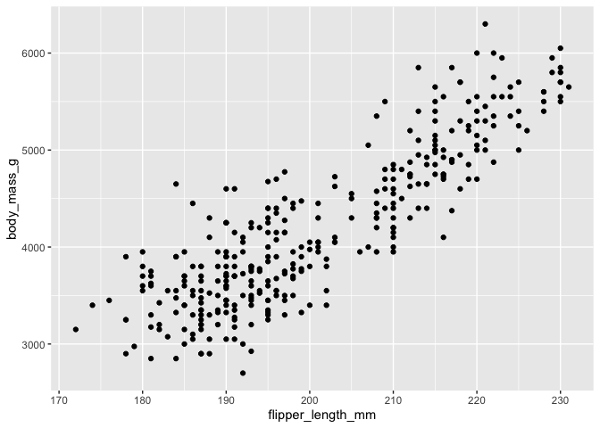<!-- -->

### 8.2 Grouping by Category (color, shape, size, transparency)

``` r
ggplot(data = penguins, aes(x = flipper_length_mm, y = body_mass_g, color = species)) +
  geom_point(aes(shape = species), size = 3, alpha = 0.7)
```

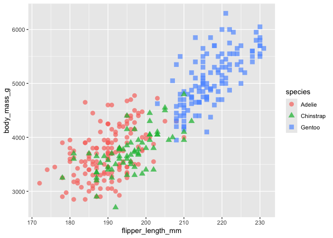<!-- -->

### 8.3 Trend Lines (Per Group vs. Overall)

``` r
# One trend line per species (color mapped globally)
ggplot(penguins, aes(x = flipper_length_mm, y = body_mass_g, color = species)) +
  geom_point(alpha = 0.7) +
  geom_smooth(method = "lm", se = FALSE)
```

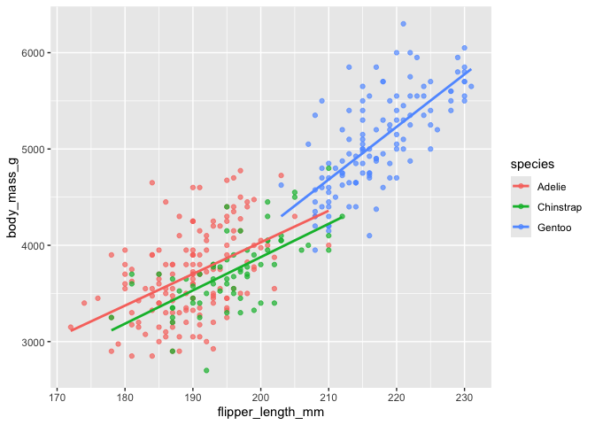<!-- -->

``` r
# Single overall trend line (color mapped only inside geom_point)
ggplot(penguins, aes(x = flipper_length_mm, y = body_mass_g)) +
  geom_point(aes(color = species), size = 3) +
  geom_smooth(method = "lm", se = FALSE, color = "red", linetype = "dashed")
```

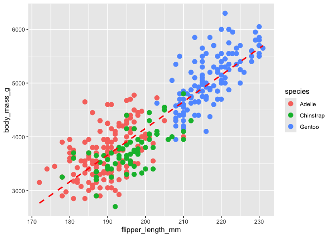<!-- -->

### 8.4 Faceting (Small Multiples)

``` r
ggplot(penguins, aes(x = flipper_length_mm, y = body_mass_g)) +
  geom_point(aes(color = species), alpha = 0.7) +
  geom_smooth(method = "lm", se = FALSE, color = "gray40", linetype = "dotted") +
  facet_wrap(~species) +
  theme_minimal()
```

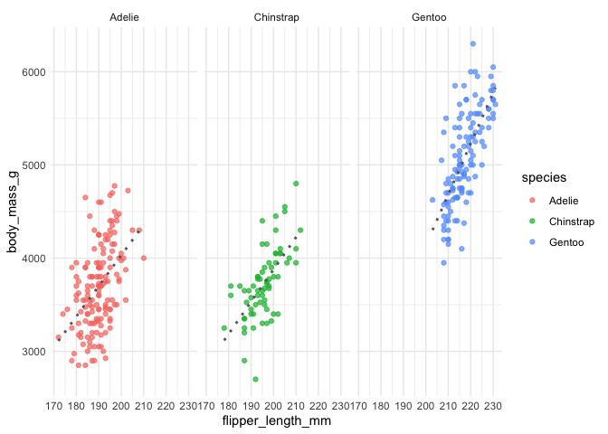<!-- -->

``` r
# Two-way faceting with facet_grid (NA rows removed first — ggplot can't drop them itself)
ggplot(data = na.omit(penguins)) +
  geom_point(aes(x = flipper_length_mm, y = body_mass_g, color = sex)) +
  facet_grid(species ~ sex)
```

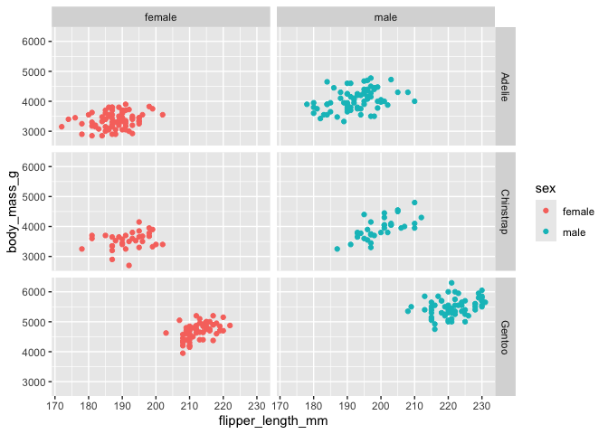<!-- -->

### 8.5 Polished, Presentation-Ready Plot

``` r
ggplot(data = penguins,
       aes(x = flipper_length_mm, y = body_mass_g, color = species)) +
  geom_point(size = 3, alpha = 0.7) +
  geom_smooth(method = "lm", se = FALSE) +
  facet_wrap(~species) +
  labs(
    title = "Relationship Between Flipper Length and Body Mass",
    subtitle = "Palmer Penguins Dataset",
    x = "Flipper Length (mm)",
    y = "Body Mass (g)",
    color = "Species"
  ) +
  theme_minimal() +
  theme(
    plot.title = element_text(face = "bold", size = 16, hjust = 0.5),
    plot.subtitle = element_text(hjust = 0.5),
    legend.position = "bottom"
  )
```

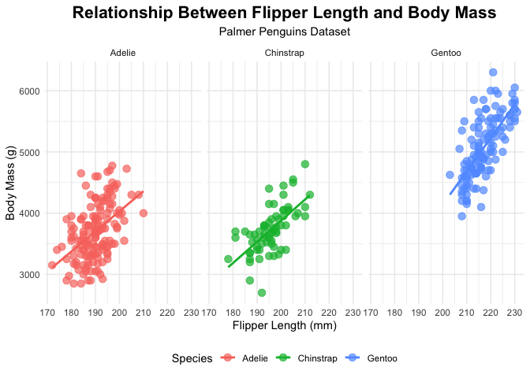<!-- -->

### 8.6 Comparing Distributions (Boxplot, Violin, Density)

``` r
ggplot(penguins, aes(x = species, y = body_mass_g, fill = species)) +
  geom_violin(alpha = 0.5) +
  geom_boxplot(width = 0.15, alpha = 0.7) +
  theme_minimal() +
  labs(title = "Body Mass Distribution by Species")
```

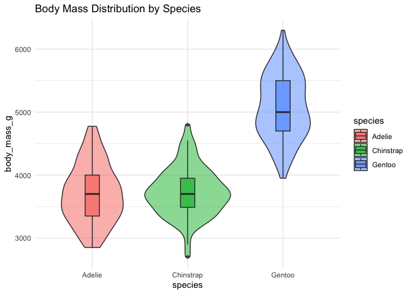<!-- -->

``` r
ggplot(penguins, aes(x = body_mass_g, fill = species)) +
  geom_density(alpha = 0.3) +
  theme_minimal() +
  labs(title = "Density Distribution of Body Mass")
```

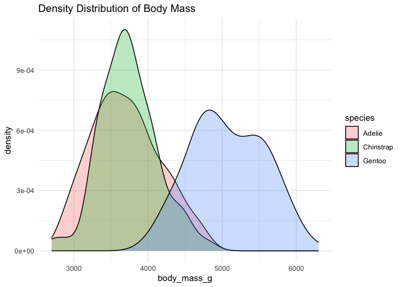<!-- -->

### 8.7 Bar Charts

``` r
ggplot(data = diamonds) +
  geom_bar(mapping = aes(x = color, fill = cut)) +
  facet_wrap(~cut)
```

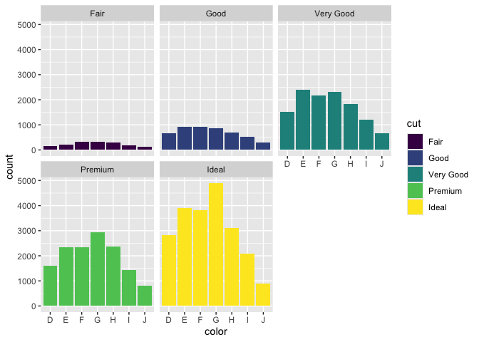<!-- -->

``` r
# Rotated axis labels for long category names
ggplot(data = penguins) +
  geom_bar(mapping = aes(x = species, fill = species)) +
  facet_wrap(~island) +
  theme(axis.text.x = element_text(angle = 45, hjust = 1))
```

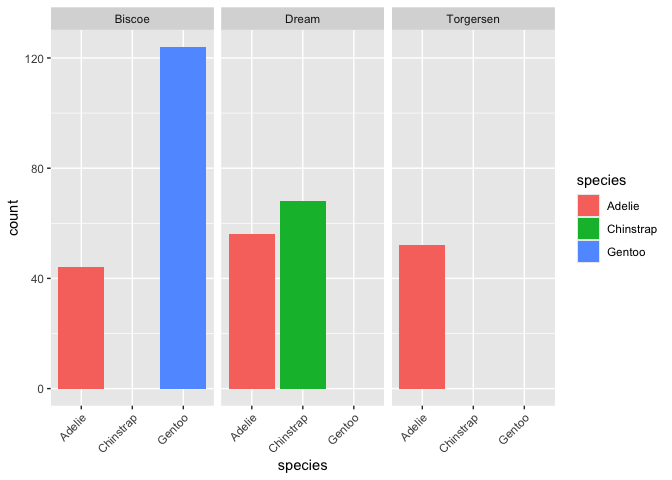<!-- -->

### 8.8 Annotations

``` r
ggplot(data = penguins) +
  geom_point(mapping = aes(x = flipper_length_mm, y = body_mass_g, color = species)) +
  labs(
    title = "Palmer Penguins: Body Mass vs. Flipper Length",
    subtitle = "3 Species",
    caption = "Data: palmerpenguins package"
  ) +
  annotate("text", x = 220, y = 3500, label = "The Gentoos are the largest",
           color = "purple", fontface = "bold", size = 3, angle = 22)
```

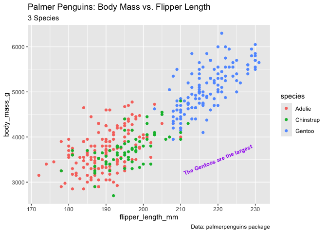<!-- -->

### 8.9 Why Visualize? Anscombe’s Quartet & the Datasaurus Dozen

These two datasets are the classic teaching example for *why summary
statistics alone are not enough* — very different-looking data can share
nearly identical means, standard deviations, and correlations.

``` r
library(Tmisc)
data("quartet")

quartet %>%
  group_by(set) %>%
  summarise(mean_x = mean(x), sd_x = sd(x), mean_y = mean(y), sd_y = sd(y), cor_xy = cor(x, y))
```

    ## # A tibble: 4 × 6
    ##   set   mean_x  sd_x mean_y  sd_y cor_xy
    ##   <fct>  <dbl> <dbl>  <dbl> <dbl>  <dbl>
    ## 1 I          9  3.32   7.50  2.03  0.816
    ## 2 II         9  3.32   7.50  2.03  0.816
    ## 3 III        9  3.32   7.5   2.03  0.816
    ## 4 IV         9  3.32   7.50  2.03  0.817

``` r
ggplot(quartet, aes(x, y)) +
  geom_point() +
  geom_smooth(method = "lm", se = FALSE) +
  facet_wrap(~set)
```

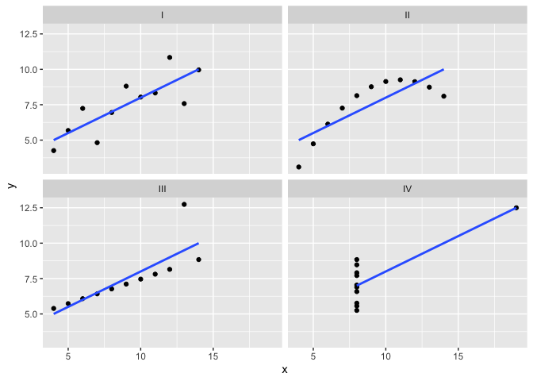<!-- -->

``` r
library(datasauRus)
data(datasaurus_dozen)

ggplot(datasaurus_dozen, aes(x = x, y = y, colour = dataset)) +
  geom_point() +
  theme_void() +
  theme(legend.position = "none") +
  facet_wrap(~dataset, ncol = 4)
```

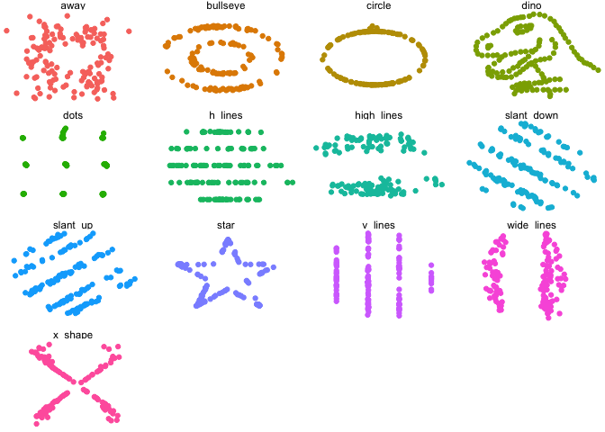<!-- -->

### 8.10 Saving a Plot

``` r
ggsave("penguin_species_plot.png")
```

------------------------------------------------------------------------

## Summary

This notebook covers, in order: dates/times, base R conditionals and
subsetting, importing and inspecting data, `dplyr` cleaning verbs,
grouping/summarizing, bias checking, and a full `ggplot2` visualization
progression from a bare scatter plot to faceted, annotated,
presentation-ready charts.
